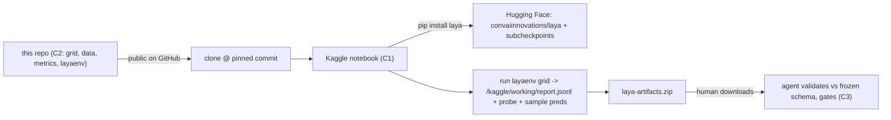

# Kaggle connection (Component 1: the cloud trainer)

The human runs a **Python notebook** in the Kaggle web UI — no CLI, no dataset
uploads. The C2 eval environment lives in **this repo** and is imported by the
notebook via a `git clone`; trained/measured artifacts travel back here.

## The rule

The notebook is the only Kaggle surface. It clones this repo at a pinned
commit, so a gate re-checks the exact `layaenv` code that produced the
numbers. The agent never runs the Kaggle CLI, never launches/uploades a
notebook, and never gates on anything a cloud run didn't return.

## Runtime

- Accelerator **GPU T4 x2**, **Internet ON** — required (weights + eval data
  are pulled from HF inside the notebook).
- The `layaenv` package is torch-free on its own; it only imports `laya`/`torch`
  inside the cloud run and on this device for local regression runs.

## Notebook #1: v0-baseline (unblocks P0-7)

What it does:

1. Clones this repo at `REF` and imports `layaenv` from the clone.
2. `pip install laya` (pulls models from Hugging Face on first `laya.load`).
3. Runs `configs/eval_grid.yaml` against all four variants —
   `english` (`convaiinnovations/laya`), `multilingual` (`…/multilingual`),
   `typed_decisions` (`…/typed-decisions`), and `router` (`laya.Router`).
4. Emits `report.jsonl` (frozen schema), `probe.jsonl` (raw SDK output on the
   probe call, so the adapter can be tightened against the real API), and
   `summary.md` + `run_meta.json`, zipped to `laya-artifacts.zip`.

Grid cells (v0-baseline-r3): typed-decisions (gold + teacher dists),
Banking77 (cardinality), SST-5 (ordinal proxy), XNLI en + **XNLI Thai**
(OOD stress; XNLI ships no Khmer config, true Khmer comes from the local
`evaldata/novelty.jsonl` hook). Local cells in `configs/eval_grid.yaml`
activate the moment you drop your private sets into `evaldata/`.

## Notebook #2: osm-train (P1.1 + P1.2 core)

Continues training from the `typed-decisions` specialist on C2 objectives:

1. **Calibration (P1.1-1)** — soft-teacher loss = negative `laya.common.proper_reward`
   against the gold teacher distributions in `LocalLLaMA/typed-decisions`, plus
   Banking77 77-way options (one-hot).
2. **In-loop temperature (P1.1-2)** — per-bucket ECE-minimising temperature refit on a
   held-out slice every `VAL_STEPS`, baked into the saved `rl_agent_config.json`.
3. **Permutation augmentation (P1.2-7)** — option order re-shuffled per example
   (uniform for `choice`, occasional flips for `noul`), teacher re-aligned. The direct
   counter to the Banking77 `option_order_robustness ~0` confound.
4. **Context 4k (P1.2-2)** — trains at 2k, serves/evaluates at `max_len=4096`,
   `head_max_len=768`.

The trained checkpoint is saved self-contained at `/kaggle/working/osm-v0/`
(rl_agent_config.json + model.safetensors + encoder/ + tokenizer/), verified by
reloading through the real `laya` SDK, then eval'd on the **same `v0-baseline-r3`
grid** (via `run_grid(force_variants=["osm-v0"])`, so the frozen grid config needs
no edits). `telemetry.jsonl` (loss + val ECE/temperature curve) rides in the zip.

## Human workflow

1. Open Kaggle → New Notebook → File → Import Notebook →
   `kaggle/notebooks/v0_baseline.ipynb` (eval) or
   `kaggle/notebooks/osm_train.ipynb` (train).
2. Settings: Accelerator `GPU T4 x2`, Internet `On`, Language `Python`.
3. Run All (eval ~15–30 min; osm-train ~1.5–2 h on T4 x2 with the default caps).
4. Download `laya-artifacts.zip` (Data → Output) and hand it back; for the
   training notebook also hand back the `osm-v0/` checkpoint directory.

## Agent workflow (offline, C3 on this device)

1. Validate every `report.jsonl` row against `layaenv/schema.py` (schema v1.0).
2. Review `probe.jsonl` and tighten `layaenv/backends.py` extraction if the
   SDK returns keys the adapter doesn't know.
3. Gate the owning ticket only from returned numbers.